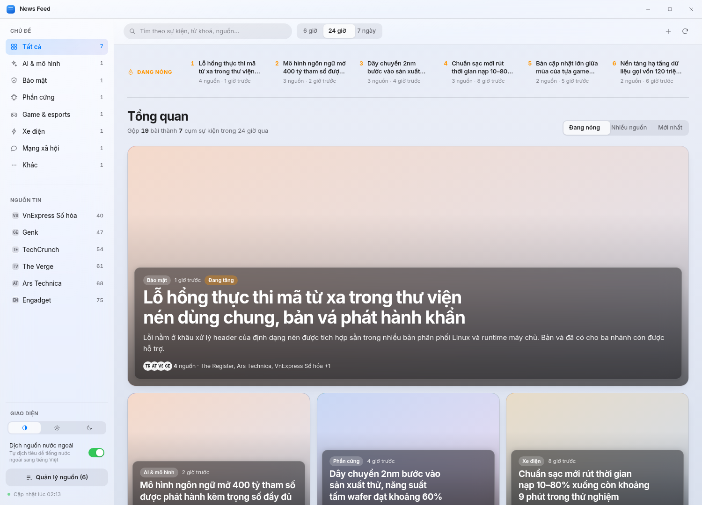
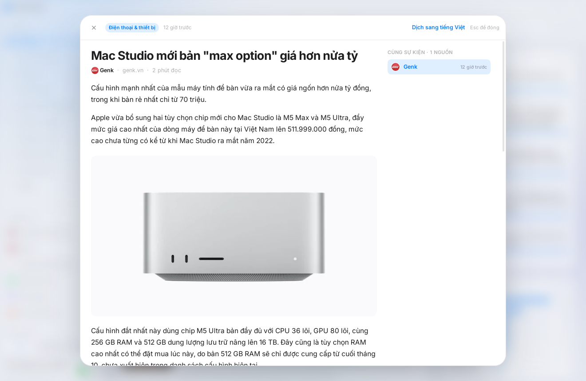
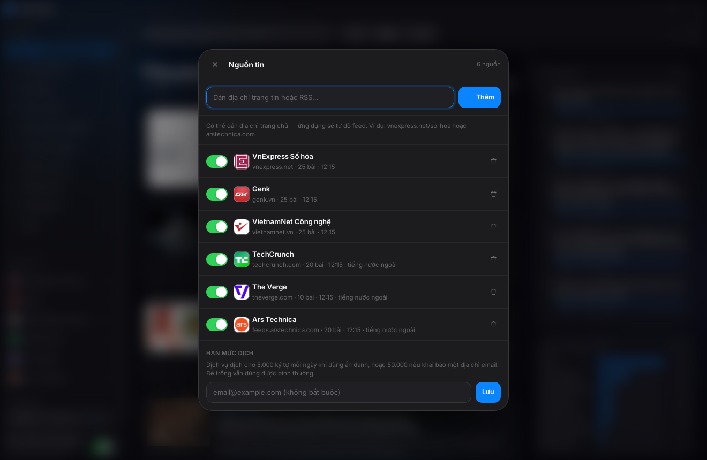
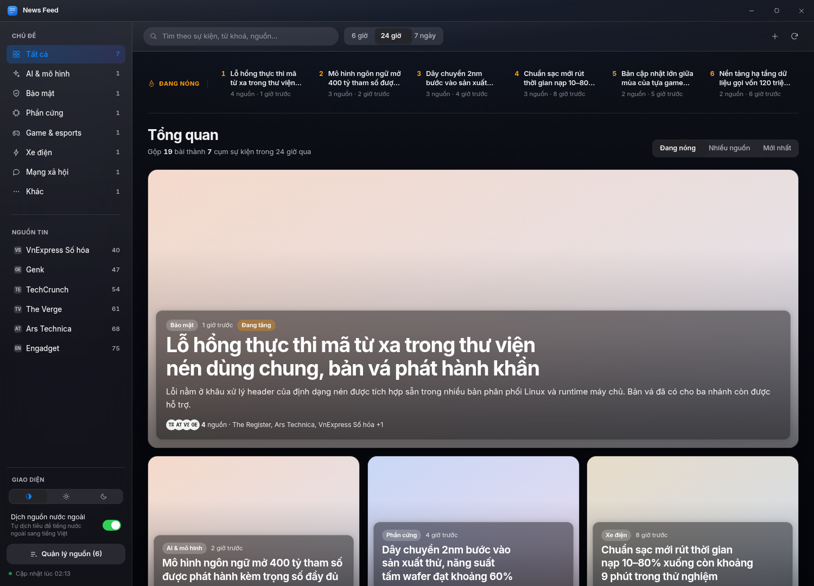

<div align="center">

# News Feed

**Đọc tin công nghệ dạng dashboard.**
Gộp tin từ nhiều báo thành cụm sự kiện, đọc bài đã bóc sạch quảng cáo, tự dịch nguồn nước ngoài.

[](https://github.com/wwwxadieu/New-Feed/releases/latest)




</div>

---

## Vì sao có ứng dụng này

Theo dõi năm bảy trang tin công nghệ mỗi ngày nghĩa là đọc đi đọc lại cùng một
sự kiện dưới năm cái tiêu đề khác nhau. Bấm vào bài nào cũng gặp quảng cáo chèn
giữa đoạn, popup đòi đăng ký nhận bản tin, và banner mời tải ứng dụng. Tin nước
ngoài thì phải copy sang chỗ khác để dịch.

News Feed gom cả ba việc đó về một chỗ, chạy ngay trên máy bạn.

## Tính năng

### Gộp tin theo cụm sự kiện

Đơn vị hiển thị là **sự kiện**, không phải bài báo lẻ. Khi nhiều báo cùng đưa
một tin, dashboard hiện một thẻ duy nhất kèm dòng "5 nguồn · VnExpress, GenK,
TechCrunch +2" thay vì năm dòng trùng nhau. Mở thẻ ra thì chuyển qua lại được
giữa các nguồn và so tiêu đề của từng báo về cùng một sự kiện.

Đó cũng là lý do giao diện là dashboard chứ không phải danh sách một cột: chỉ
dashboard mới cho thấy được thứ mà một danh sách tuyến tính không diễn đạt nổi
— tin nào đang được nhiều nơi nhắc tới, mảng nào đang nóng, mảng nào im ắng.

### Đọc bài đã bóc sạch quảng cáo



Bấm vào một cụm là bài mở ngay trong ứng dụng: chỉ còn chữ và ảnh của bài gốc.
Quảng cáo, popup, tường thu phí và script theo dõi đều bị loại trước khi hiển
thị. Ảnh trong bài được giữ nguyên, kể cả ảnh lazy-load mà trình duyệt thường
phải cuộn tới mới tải.

### Tự dịch nguồn nước ngoài

Tiêu đề và tóm tắt của báo tiếng nước ngoài được dịch sang tiếng Việt ngay
trong dòng tin, có nhãn *đã dịch* để phân biệt với nguyên văn. Mở bài ra thì
dịch được cả thân bài bằng một nút bấm, và xem lại nguyên văn bất cứ lúc nào.

Ứng dụng tự nhận ra nguồn nào là tiếng nước ngoài dựa trên dấu chữ quốc ngữ
trong tiêu đề, không cần khai báo tay.

### Thêm nguồn nào cũng được



Dán địa chỉ trang chủ là đủ — `vnexpress.net/so-hoa` hay `arstechnica.com` —
ứng dụng tự dò ra feed. Không tìm thấy thẻ khai báo thì nó suy ra đường dẫn
theo chuyên mục, kiểu `/rss/{chuyên-mục}.rss` mà báo Việt Nam hay dùng. Dán
thẳng địa chỉ RSS cũng được.

Mỗi nguồn hiện logo lấy từ chính trang của nó, bật tắt và xoá riêng từng
nguồn, và báo rõ nguồn nào đang lỗi.

Hơn ba mươi nguồn có sẵn ngay lần chạy đầu, xếp theo đúng các chủ đề mà ứng
dụng phân loại: báo công nghệ trong nước (VnExpress Số hóa, GenK, VietnamNet,
Tinh tế, Dân trí, Tuổi Trẻ, Thanh Niên), báo quốc tế đưa tin rộng (TechCrunch,
The Verge, Ars Technica, Engadget), rồi các nguồn chuyên đề cho AI, bảo mật,
phần cứng, thiết bị, game, startup, xe điện, mạng xã hội và không gian.

Bản cập nhật thêm nguồn mới thì máy đang dùng dở cũng nhận được — ứng dụng ghi
lại từng nguồn đã đề nghị một lần, nên nguồn bạn cố ý xoá không mọc lại.

### Tự phân loại chủ đề

Tin được xếp vào **AI & mô hình, Bảo mật, Phần cứng, Điện thoại & thiết bị,
Game & esports, Xe điện, Mạng xã hội, Không gian**. Thanh bên
lọc theo chủ đề hoặc theo từng nguồn, kèm khoảng thời gian 6 giờ / 24 giờ /
7 ngày và ô tìm kiếm.

### Chạy tốt trên màn hình 2K trở lên

Khung, cỡ chữ và bề rộng cột đều nới theo bề ngang cửa sổ, qua bốn mốc:
1800px, 2400px và 3000px. Trên màn 2K, tấm đọc bài cao gấp rưỡi và chữ thân
bài tăng từ 15,5px lên 18,5px, nhìn thấy khoảng 42 dòng cùng lúc thay vì 32.

Việc phóng to làm bằng kích thước thật chứ không dùng `zoom` hay
`transform: scale` — hai cách đó phóng ảnh đã dựng nên chữ sẽ mờ. Mốc tính
theo pixel CSS, nên máy đặt tỷ lệ hiển thị 125–150% vẫn nhận đúng khổ chữ
tương ứng với không gian thật mà nó có.

### Cuộn mượt có độ nảy

Cuộn dòng tin và cuộn bài đọc đều có chuyển động trôi dần thay vì nhảy từng
nấc, và nảy lại khi chạm mép trên hoặc mép dưới. WebView trên Windows không
có sẵn hiệu ứng này như macOS nên ứng dụng tự dựng. Thanh cuộn kéo tay và
phím điều hướng vẫn chạy theo cơ chế gốc, và hiệu ứng tự tắt nếu hệ điều hành
bật chế độ giảm chuyển động.

### Giao diện sáng và tối



Ba chế độ: theo hệ thống, sáng, tối. Chế độ tự động đổi ngay khi bạn đổi cài
đặt Windows, không cần khởi động lại. Thiết kế theo hệ màu và chất liệu của
Apple, phần khung dùng kính mờ còn vùng đọc để nền đục cho dễ đọc chữ dài.

### Chạy hoàn toàn trên máy bạn

Không có máy chủ, không có tài khoản, không thu thập gì. Toàn bộ dữ liệu nằm
trong `%APPDATA%/app.newsfeed.desktop` trên máy bạn. Ứng dụng chỉ nối mạng để
tải tin từ chính những nguồn bạn thêm vào.

Bản cài **2,6 MB**, chạy tốn khoảng 80 MB RAM.

## Cài đặt

Tải bộ cài ở [trang phát hành](https://github.com/wwwxadieu/New-Feed/releases/latest):

- **`.exe`** — bộ cài thường dùng, chạy là xong
- **`.msi`** — gói MSI, dùng khi triển khai qua chính sách nhóm

Bộ cài có trang chọn thư mục nên đổi được nơi cài. Mặc định là
`%LOCALAPPDATA%\News Feed`, cài cho riêng người dùng hiện tại nên không cần
quyền quản trị và không hiện hộp thoại UAC.

Yêu cầu: Windows 10 hoặc 11. Không cần cài .NET hay runtime nào khác —
WebView2 đã có sẵn trong hệ điều hành.

## Dựng từ mã nguồn

```bash
npm install

# Xem giao diện trong trình duyệt với dữ liệu mẫu, không cần Rust
npm run dev

# Chạy ứng dụng desktop thật
npm run app:dev

# Dựng bộ cài (cần Rust và Visual Studio Build Tools)
npm run app:build
```

Không muốn cài Rust thì đẩy nhánh lên GitHub, workflow
`.github/workflows/build-windows.yml` tự dựng trên máy ảo Windows và đính bộ
cài vào phần Artifacts.

## Công cụ

| Thành phần | Lựa chọn | Lý do |
| --- | --- | --- |
| Khung ứng dụng | **Tauri v2** | Bộ cài 2,6 MB, dùng WebView2 có sẵn trong Windows. Electron cho cùng chức năng nặng 120–150 MB. |
| Backend | **Rust** | Tải nguồn, bóc tách HTML và gộp cụm chạy native, không chặn giao diện. |
| Giao diện | **React 19 + TypeScript + Vite** | Bundle 72 KB gzip, dựng lại nhanh, kiểu chặt. |
| Phông chữ | **Inter Variable** đóng gói kèm | Đủ bộ dấu tiếng Việt, chạy được offline. |
| Hiệu ứng | CSS thuần | Không thêm thư viện animation nào. |

## Cách hoạt động bên trong

```
Thêm nguồn ──► dò feed ──► đọc feed ──► gộp cụm ──► dashboard
  (URL bất kỳ)  (tự tìm RSS)  (feed-rs)  (chồng lấn có trọng số)
                                                      │
                                           mở một cụm ─┴──► tải trang bài
                                                            ──► bóc tách
                                                            ──► đọc sạch
```

**Dò feed** (`src-tauri/src/fetcher.rs`). Tìm thẻ
`<link rel="alternate">`, không có thì suy ra đường dẫn theo chuyên mục rồi
thử các đường dẫn quen thuộc. Luôn bám theo địa chỉ sau chuyển hướng, nên
trang đổi tên chuyên mục vẫn dò được.

**Ảnh bài.** Mỗi báo mang ảnh một kiểu nên phải thử lần lượt: thẻ
`<media:content>`, rồi `<enclosure>` (VnExpress), rồi thẻ `` đầu tiên
trong phần mô tả (GenK). Nguồn nào không kèm ảnh trong feed thì đọc `og:image`
của trang bài — chỉ tải phần đầu trang rồi dừng ngay khi hết `<head>`. Đo trên
nhóm nguồn mặc định: 125/125 bài có ảnh.

**Giới hạn khi giải mã ảnh.** Ảnh tải từ Internet là dữ liệu không kiểm soát
được. Một tệp PNG 60 KB có thể khai báo 8000x8000 và bung ra 183 MB dạng RGB,
đủ để làm cạn bộ nhớ. Ứng dụng đọc kích thước từ phần đầu tệp trước khi cấp
phát, từ chối ảnh vượt 24 triệu điểm ảnh, và bọc phần giải mã trong
`catch_unwind` để một tấm ảnh dị dạng không thoát ra ngoài phạm vi của nó.
Bản release cố ý không đặt `panic = "abort"` vì lý do đó.

**Thẻ tin dạng áp phích.** Ảnh phủ toàn thẻ, chữ đặt trên một tấm kính mờ ở
đáy. Chữ luôn màu sáng ở cả giao diện sáng lẫn tối, vì nền của nó là ảnh bài
chứ không phải nền của ứng dụng, kèm một lớp phủ tối chuyển dần để tương phản
không phụ thuộc vào tấm ảnh vớ được. Đo trên trường hợp xấu nhất là ảnh trắng
toát: 5,9–6,8:1, trên ngưỡng dễ đọc 4,5:1.

Kính thật chỉ đặt ở tin hero và ba tin đặc tả, tức bốn thẻ, chứ không phải cả
dòng tin. Đo trên 60 thẻ khi cuộn: để kính ở mọi thẻ thì khung hình trung vị
đi từ 18,1ms lên 34,5ms và số khung trễ từ 3/85 lên 82/85. Giảm bán kính làm
mờ không cứu được — 8px cho 34,2ms, 4px cho 35,5ms — vì cái đắt là bản thân
backdrop-filter tạo một lớp hợp ảnh riêng cho mỗi thẻ, không phải bán kính.
Thẻ ở lưới dùng tấm nền đục hơn một chút, không làm mờ; đặt trên ảnh đã bị
lớp phủ làm tối thì mắt gần như không phân biệt được, mà khung hình trung vị
giữ nguyên 18,6ms.

**Phần đầu kiểu tạp chí.** Bốn cụm đầu dòng tin được dựng theo lối tạp chí:
một tin hero với ảnh lớn và tiêu đề cỡ 40px, dưới là hàng ba tin đặc tả. Phần
còn lại giữ lưới thẻ đều của dashboard.

Chỉ vài cụm đầu được đối xử như vậy là có chủ ý. Phân cấp kiểu tạp chí là một
thủ pháp biên tập, nó cần tín hiệu đủ mạnh để nói tin nào xứng đáng lớn hơn;
ở đây tín hiệu đó là điểm cụm, mà điểm chỉ tách bạch ở vài cụm đầu. Xuống tới
cụm thứ hai ba mươi thì điểm gần bằng nhau, lúc đó thẻ to nhỏ khác nhau không
còn là phân cấp mà thành lộn xộn. Dưới năm cụm thì không đủ để dựng phân cấp
nên quay hẳn về lưới thường.

**Hai cỡ ảnh.** Ảnh lưới rộng 480px, vừa đủ cho khung lớn nhất của lưới là
196px trên màn mật độ cao. Ô ảnh của tin hero rộng 649px CSS, tức 1.298 điểm
ảnh thật ở màn mật độ cao, nên dùng bản 480px ở đó phải kéo giãn gần ba lần và
mờ thấy rõ. Vì vậy 16 cụm đầu bảng được tải thêm một bản rộng 1.440px. Không
tải cho cả kho vì chỉ vài cụm đầu mới lên hero, mà giới hạn 16 là để còn phủ
được các kiểu sắp xếp và bộ lọc khác nhau của người dùng.

**Ảnh đại diện tải sẵn.** Ảnh được tải và thu về bề ngang 480px ngay trong
lượt làm mới, lưu vào thư mục đệm rồi hiển thị qua giao thức asset của Tauri.
Để giao diện tự tải từ máy chủ của báo thì mỗi thẻ tin là một lượt gọi mạng
riêng và ảnh gốc thường lớn gấp nhiều lần khung hiển thị. Đo trên tám ảnh
thật: 1.484 KB còn 168 KB, tức 11%. Ảnh của bài đã bị đẩy khỏi kho được xoá
theo trong mỗi lượt làm mới.

**Nguồn dựng bằng JavaScript.** Có trang, ví dụ tinhte.vn, đưa thân bài vào
một khối JSON và chỉ dựng ra HTML sau khi trình duyệt chạy mã, nên bóc tách
theo mật độ chữ không thấy gì. Nhưng khối JSON đó nằm ngay trong HTML trả về,
trong thẻ `<script id="__NEXT_DATA__">`, lấy được bằng một lượt tải bình
thường. Khi bóc được dưới 120 từ, ứng dụng đọc tiếp khối này; không có thì
mới lùi về nội dung của feed và ghi rõ đây chỉ là phần đầu bài.

Chọn đúng bài trong khối JSON là phần khó. Khối này còn chứa bài liên quan,
tin nổi bật và sự kiện, và chúng thường dài hơn bài đang đọc — đo trên
tinhte.vn thì chuỗi HTML dài nhất là một bài sự kiện 58 KB chẳng liên quan
gì. Nên không chọn theo độ dài mà neo theo tiêu đề: tìm nút mang tiêu đề
khớp với tiêu đề trang rồi mới lấy thân bài bên trong nút đó, không khớp
được thì trả về rỗng chứ không đoán bừa.

Thân bài của các trang này thường không có thẻ `<p>` nào — một bài review
2.577 từ chỉ gồm `<br>`, `<h2>`, `<li>` và `` — nên phải duyệt cây theo
đúng thứ tự tài liệu và hiểu hai thẻ `<br>` liên tiếp là hết đoạn. Lọc theo
bộ chọn thẻ khối như trước sẽ lấy được tiêu đề phụ với danh sách rồi bỏ mất
toàn bộ phần chữ chính, mà vẫn trông như đã thành công.

Ảnh cũng phải lấy từ `data-permalink` chứ không phải `src`: `src` của
tinhte.vn là địa chỉ kèm token hết hạn, tải về trả mã 307 với 0 byte. Đo
trên sáu bài mới nhất: cả 6 ra toàn văn thay vì tóm tắt, và 7/7 ảnh của bài
review tải được thật.

**Logo nguồn.** Lấy icon từ chính trang của nguồn, ưu tiên `apple-touch-icon`
vì thường là PNG 180px, rồi tới `<link rel="icon">`, cuối cùng `/favicon.ico`.
Ảnh nhúng thẳng vào dữ liệu dạng data URI nên hiện được cả khi offline.

**Gộp cụm** (`src-tauri/src/cluster.rs`). Tách tiêu đề thành từ, bỏ từ dừng
tiếng Việt và tiếng Anh, tính hệ số chồng lấn có trọng số IDF làm trơn — từ
càng hiếm trong kho tin thì càng nặng, nên tên riêng quyết định việc gộp. Dùng
`min(a, b)` làm mẫu số thay vì hợp của hai tập, vì hai bản tin về cùng sự kiện
thường khác nhau đáng kể về độ dài tiêu đề và Jaccard phạt chênh lệch đó quá
nặng. Hai bài cách nhau quá 72 giờ thì không gộp dù tiêu đề giống nhau.

**Phân loại chủ đề.** Bảng từ khoá, xét chủ đề hẹp trước chủ đề rộng. Thứ tự
có ý nghĩa: game đứng trước nhóm thiết bị để tin về PS5 hay tai nghe chơi game
không bị nhóm thiết bị bắt trước, và cả hai đứng trước AI vì gần như mọi tin
công nghệ bây giờ đều nhắc tới AI ở đâu đó.

**Bóc tách** (`src-tauri/src/extract.rs`). Xoá thẻ script/iframe/nav/footer,
xoá phần tử có lớp hoặc id khớp mẫu quảng cáo, popup và tường thu phí, rồi
chọn khối có mật độ chữ cao nhất làm thân bài.

**Dịch** (`src-tauri/src/translate.rs`). Dùng MyMemory — dịch vụ có tài liệu
công khai, không cần khoá API và không dùng mô hình ngôn ngữ lớn. Hạn mức miễn
phí tính theo ký tự mỗi ngày nên việc dịch được cấp phát theo hạn ngạch ký tự
thay vì đếm số bài, và tiêu đề với tóm tắt của cùng một bài đi liền nhau để
thẻ tin không bị nửa Việt nửa Anh. Khai một địa chỉ email trong phần Nguồn tin
sẽ nâng hạn mức từ 5.000 lên 50.000 ký tự mỗi ngày.

**Lưu trữ.** JSON trong thư mục cấu hình của người dùng, ghi ra file tạm rồi
đổi tên nên mất điện giữa chừng không làm hỏng dữ liệu.

## Kiểm thử

```bash
# Kiểm thử logic bóc tách, gộp cụm, phân loại và dịch (không cần mạng)
cargo test --manifest-path src-tauri/Cargo.toml

# Kiểm thử đường ống thật với trang tin thật (có chạm mạng)
cargo test --manifest-path src-tauri/Cargo.toml -- --ignored --nocapture
```

Kiểm thử chạm mạng chạy trọn vòng với ba trang thật: dò feed từ địa chỉ trang
chủ, đọc feed, tải một bài rồi bóc tách, và in ra số từ, số ảnh, tỷ lệ bài có
ảnh cùng số khối quảng cáo đã loại bỏ.

## Cấu trúc

```
src/                    Giao diện React
  components/           Các thành phần màn hình
  lib/                  Kiểu dữ liệu, gọi API, chủ đề sáng/tối
  styles/               Token thiết kế và CSS
src-tauri/src/
  lib.rs                Các lệnh Tauri, trạng thái ứng dụng
  fetcher.rs            Dò feed, tải nguồn, tải bài, lấy logo và ảnh
  extract.rs            Bóc tách nội dung, loại quảng cáo
  cluster.rs            Gộp cụm sự kiện, phân loại chủ đề
  translate.rs          Dịch sang tiếng Việt, nhận diện ngôn ngữ
  store.rs              Lưu/đọc trạng thái ra đĩa
```

## Về bản quyền nội dung

Ứng dụng tải và hiển thị toàn văn bài viết sau khi loại quảng cáo. Với sử dụng
cá nhân thì đây là chuyện bình thường, tương đương chế độ Reader của trình
duyệt. Nếu định phát hành rộng rãi, cần cân nhắc: hiển thị toàn văn bài có bản
quyền đồng thời loại bỏ phần tạo doanh thu của toà soạn là rủi ro pháp lý
thực. Hướng an toàn hơn là bóc tách toàn văn ở phía sau để phục vụ gộp cụm và
tóm tắt, còn phía trước chỉ hiện tóm tắt tổng hợp kèm link về bài gốc.
